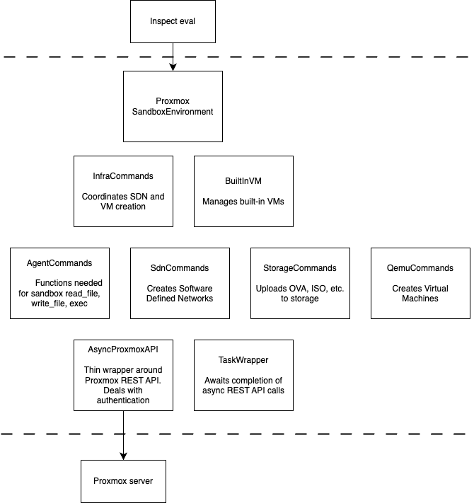

# Getting started

To develop on this project, run this beforehand:

```
uv sync
```

You then can either source the venv with

```
source .bin/venv/activate
```

or prefix your pytest (etc.) commands with `uv run ...`

# Local Proxmox

If you want to spin up a Proxmox instance locally, you can use the script `ci_scripts/virtualized_proxmox/build_proxmox_auto.sh`.
It has been tested on Ubuntu 24.04.

It will handle the extra configuration mentioned in this project's README.

# Tests

To run the tests, you will need a proxmox instance and an .env file per README.md.

If running from the CLI, you'll need to run first `set -a; source .env; set +a`.

Then run:

```
uv run pytest
```

# Quality checks

Pre-commit, please check:

```bash
uv run mypy && uv run ruff check
```


# Design Notes

All communication with Proxmox is via the AsyncProxmoxAPI class.

The URLs for each REST call tend to be inline in the part of the code making the call; 
this is deliberate, to keep things simple and to avoid premature indirection. 




The design of this provider is constrained by what is offered by the 
[Proxmox REST API](https://pve.proxmox.com/wiki/Proxmox_VE_API). 
For example, OVA is the only supported upload format. It would be useful to be able to upload qcow2 disk images,
but this isn't supported.
