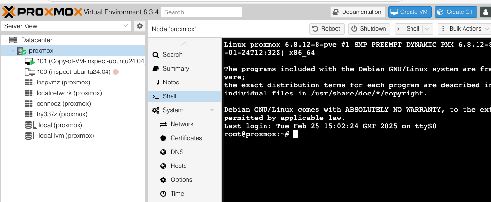

# Inspect Proxmox Sandbox

## Purpose

This plugin for Inspect allows you to use virtual machines, running within a Proxmox instance, as sandboxes.

Status: pre-alpha.

## Installing

Add this using Poetry

```
poetry add git+ssh://git@github.com/AI-Safety-Institute/inspect-vm-sandbox.git
```

or in uv,

```
uv add git+ssh://git@github.com/AI-Safety-Institute/inspect-vm-sandbox.git
```

## Requirements

You must be in RPv2. You will need to get a Proxmox host, port, user, and password from the platform team.

Create a .env file with the following

```
PROXMOX_HOST=[ip/domain of host]
PROXMOX_PORT=[port]
PROXMOX_USER=[user, usually 'root']
PROXMOX_REALM=pam
PROXMOX_PASSWORD=[password]
```

## Configuring

Here is a full example sandbox configuration. 

Note that some of the fields (e.g. subnets) are tuples, so the trailing comma is vital 
if there is only a single item in the tuple.

Most tools use only the first sandbox, so you should list the one you want the agent to operate from first.

```python
sandbox=SandboxEnvironmentSpec(
    "proxmox",
    ProxmoxSandboxEnvironmentConfig(
        # These config items will be taken from environment variables, if not specified here
        host="[hostname of proxmox server]",
        port="[port e.g. 8006],
        user="[username e.g. root, the proxmox default]",
        password="[password]",
        user_realm="[realm e.g. pam, the proxmox default]",
        # End config from environment

        vms_config=(
            VmConfig(
                # A virtual machine that this provider will install and configure automatically.
                vm_source_config=VmSourceConfig(
                    built_in="ubuntu24.04" # currently supported: "ubuntu24.04" or "kali"; see schema.py
                ),
                name="romeo", # name is optional, but recommended - it will be shown in the Proxmox GUI
                ram_mb=512 # optional, default is 2048 MB
                vcpus=4 # optional, default is 2. No attempt is made to check that this will fit in the Proxmox host.
            ),
            # A virtual machine to restore from backup.
            VmConfig(
                vm_source_config=VmSourceConfig(
                    existing_backup_name="vzdump-qemu-[vm id]-[datestamp of backup].vma.zst"
                ),
            ),
            # A virtual machine from a local OVA, which will be uploaded from here to the Proxmox server.
            VmConfig(
                vm_source_config=VmSourceConfig(
                    ova=Path("./tests/oVirtTinyCore64-13.11.ova")
                ),
            ),
            # A virtual machine from a hosted OVA, which will be downloaded by the Proxmox server.
            VmConfig(
                vm_source_config=VmSourceConfig(
                    ova=HttpUrl("https://cloud-images.ubuntu.com/noble/current/noble-server-cloudimg-amd64.ova")
                ),
            ),
            # A virtual machine that exists in the eval sample, but is not a sandbox.
            VmConfig(
                # ... snip ...
                is_sandbox = False
            ),
            # If you have more than one VNet, assign the VM to the VNet via nics.
            # You can assign more than one, to give the VM more than one network interface.
            # If you leave this blank, your VM will be assigned to the first VNet.
            VmConfig(
                # ... snip ...
                nics=(
                    VmNicConfig(
                        # This alias *must* match the alias in one of the VnetConfigs
                        vnet_alias="my special vnet",
                        # Specifying a MAC address is optional - only needed if you
                        # are doing fancy things with DHCP in your eval
                        mac="00:16:3d:1d:eb:a0"
                    ),
                )
            ),
        ),
        # You will need a separate SDN per sample, or the VMs will be able to see each other
        # IP ranges *must* be distinct, unfortunately.
        # If you don't care about any of this, you can leave this blank
        # and you will get an IP range somewhere in 192.168.[2 - 253].0/24
        sdn_config=SdnConfig(
            vnet_configs=(
                VnetConfig(
                    # You can leave subnets blank if you are handling IPAM yourself (e.g. with your own pfsense instance as a VM)
                    subnets=(
                        SubnetConfig(
                            cidr=ip_network("192.168.20.0/24"),
                            gateway=ip_address("192.168.20.1"),
                            snat=True,
                            dhcp_ranges=(
                                DhcpRange(
                                    start=ip_address("192.168.20.50"),
                                    end=ip_address("192.168.20.100"),
                                ),
                            ),
                        ),
                    ),
                    alias="my special vnet"
                ),
            ),
            # Set use_pve_ipam_dnsnmasq to True if you want your instances to be able to access the internet
            use_pve_ipam_dnsnmasq=True,
        ),
    ),
)
```

## Using backup files

Proxmox's HTTP API will not let you upload a .zst backup file.

Instead:

1. Upload your zst backups to S3
2. Connect to the web frontend (see section Observing the VMs)
3. Open Datacenter -> Proxmox node -> Shell
4. Paste in temporary AWS S3 credentials
5. Download the zst backups into /var/lib/vz/dump



## Observing the VMs

Note, if you are having problems, then setting Inspect's sandbox_cleanup=False will be helpful.

To access the Proxmox UI, at the moment you need to forward the port as follows.

Suppose your developer VM is called `my-dev-vm`, and assuming you copy your `.env` file onto your Mac, you can run on your Mac:

`set -a; source .env; set +a`

Then you can ssh as follows

`ssh -L "localhost:8006:$PROXMOX_HOST:$PROXMOX_PORT" my-dev-vm`

Then open the page https://locahost:8006, accept the certificate warning, and log in with the username and password from the .env flile

The built-in VM has username ubuntu, password Password2.0 (this will be changed to be autogenerated)

## Snapshot

QEMU, the virtualization library used by Proxmox, allows you to snapshot a running virtual machine, 
including the running processes. See [snapshots.py](./src/proxmoxsandbox/experimental/snapshots.py) for example tools that use this.

## Feature Roadmap

- Proxmox server health and config check
- More config options for VMs (vCPU, RAM, etc)
- Normalize having a second pfSense VM as the default route for networking
- Firewall off the SDN from the Proxmox server and from other SDNs
- Support existing_vm_template_tag VM source
- Add more built-in VMs (Debian)
- Support cloud-init for VM definition
- Cache VM definition as tagged template VMs

## Tech debt

- Types, mypy, ruff, etc.
- Kali startup is flaky
- Test coverage is not great and it's not well documented how to get started running them
- Error handling, especially surfacing the HTTP body text when the Proxmox server returns HTTP 500
- Does not work with Inspect's post-hoc sandbox cleanup feature

## Developing

To develop on this project, run this beforehand:

```
uv sync
```

You then can either source the venv with

```
source .bin/venv/activate
```

or prefix your pytest (etc.) commands with `uv run ...`
